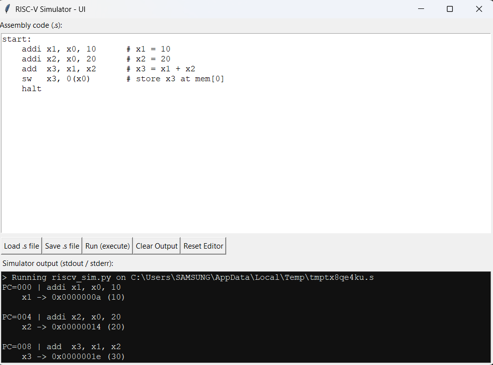
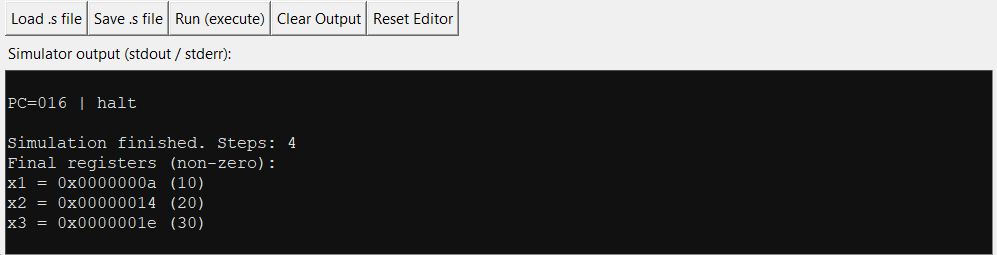
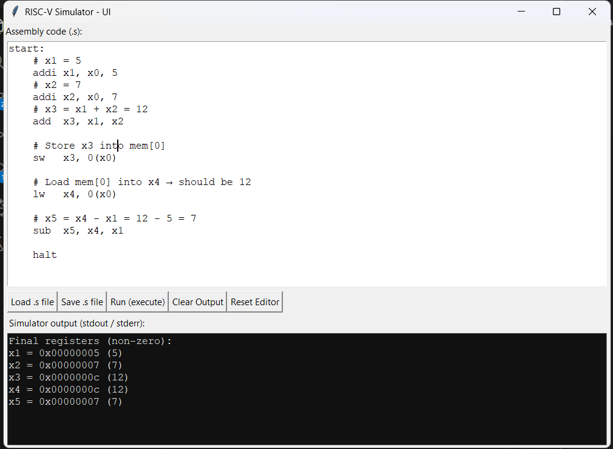
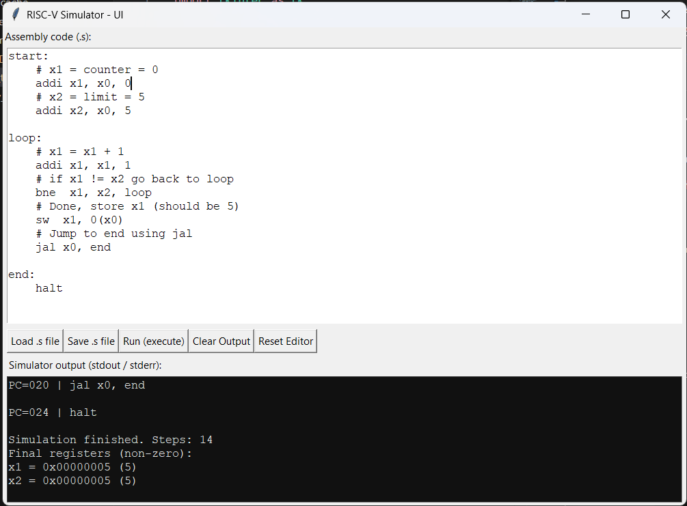

# RISC-V Toy Simulator (Python)


A minimal **RV32I-like simulator** written in Python, featuring a clean **Tkinter GUI** for editing, running, and debugging assembly programs.

> **Purpose:** Designed for Computer Organization & Architecture (COA) projects, learning CPU internals, and experimenting with basic RISC-V instructions without the overhead of a full toolchain.

---

## 🚀 Features
* **Lightweight Simulator:** Distinct Python implementation of core RV32I behavior.
* **Integrated GUI:** Built-in Tkinter editor and runner—no external IDE needed.
* **Visual Debugging:** Step-by-step instruction tracing with visible PC updates.
* **State Logging:** Real-time logs for Register file and Memory write operations.
* **Smart Branching:** Label-based branching (no manual offset calculation required).
* **File Support:** Load and save standard `.s` assembly files.

---

## 📸 Screenshots

Below are the four screenshots demonstrating the working of the simulator and test programs.

### 1️⃣ Default GUI Window  


### 2️⃣ Default Program Output  


### 3️⃣ Test Program 1 — Arithmetic & Memory   


### 4️⃣ Test Program 2 — Loop & Branching    


---

## 📂 Project Layout
```text
.
├── riscv_sim.py      # Core RISC-V simulator logic (Classes & Execution)
├── risc_tk.py        # Tkinter user interface (Editor & Controls)
├── example.s         # Sample assembly program
├── README.md         # Documentation
└── screenshots/      # Image assets for documentation
````

-----

## 🧠 Supported Instructions

This simulator implements a subset of the RV32I instruction set, optimized for educational use.

| Type | Mnemonic | Function | Example |
| :--- | :--- | :--- | :--- |
| **Arithmetic** | `add` | Addition | `add x1, x2, x3` |
| | `sub` | Subtraction | `sub x1, x2, x3` |
| | `addi` | Add Immediate | `addi x1, x0, 10` |
| **Memory** | `lw` | Load Word | `lw x1, 0(x2)` |
| | `sw` | Store Word | `sw x1, 4(x2)` |
| **Control** | `beq` | Branch if Equal | `beq x1, x2, label` |
| | `bne` | Branch if Not Equal | `bne x1, x2, label` |
| | `jal` | Jump and Link | `jal x1, label` |
| | `jalr` | Jump and Link Register | `jalr x0, 0(x1)` |
| **System** | `halt` | Stop Execution | `halt` |
| | `ecall` | Environment Call | `ecall` |

-----

## ▶️ How to Run

### Prerequisites

  * Python 3.x
  * Tkinter

### 1\. Run the GUI (Recommended)

Launch the visual editor to write and debug code interactively.

```bash
python risc_tk.py
```
-----

## 📝 Example Program

Here is the standard `example.s` included in the repo. It calculates 10 + 20 and stores the result in memory.

```asm
start:
    addi x1, x0, 10     # Load 10 into x1
    addi x2, x0, 20     # Load 20 into x2
    add  x3, x1, x2     # x3 = x1 + x2 (30)
    sw   x3, 0(x0)      # Store result (30) at memory address 0
    halt                # Stop execution
```

-----

## 📌 Technical Notes

  * **Assembler:** Uses a simple two-pass assembler to resolve labels.
  * **Addressing:** Memory is byte-addressed.
  * **Alignment:** `lw` and `sw` instructions require **4-byte alignment**.
  * **Labels:** Branches and jumps use absolute PC labels rather than relative offsets for simplicity.
  * **Registers:** `x0` is strictly hardwired to zero. Writing to it has no effect.

